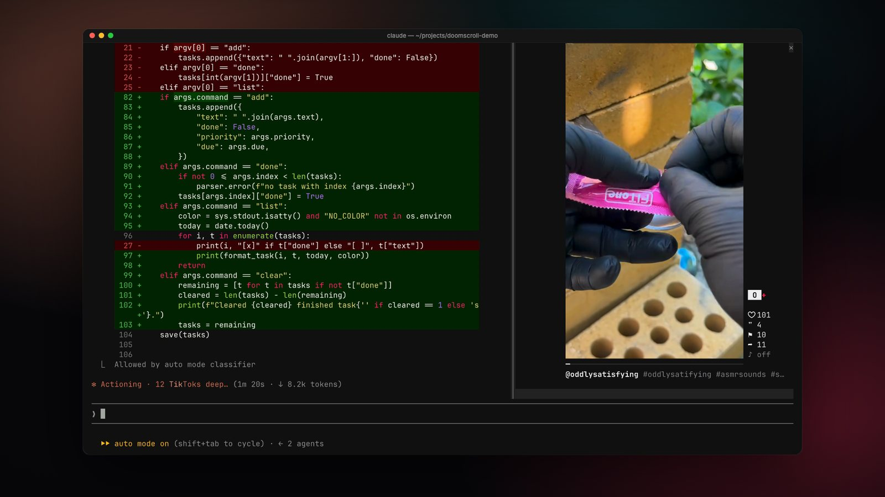

# Doomscroll

A TikTok-style video feed in a pane beside Claude Code. It opens when Claude starts working, plays while Claude works, swipes to the next video with your mouse wheel, and pauses the moment Claude is done: *Claude's done. Back to work.*

<p align="center"></p>

It is a [Claude Code mod](https://code.claude.com/docs/en/plugins/mods/overview): a plugin of function hooks that draws its own pane. The video is real video, decoded with ffmpeg and drawn with the kitty graphics protocol, at 30 frames a second, with sound.

## What you get

- **A For You feed.** About 70 creators across comedy, memes, slop and oddly satisfying videos, animals, sports, unhinged brand accounts, TV clips and streamers. Each session samples a fresh mix, and you can add your own creators.
- **TikTok's swipe.** The wheel or trackpad over the pane slides to the next video, the way the app does. Upcoming videos download ahead, so the next one is already there.
- **It knows when to stop.** The pane plays while Claude works and pauses when the turn ends. The spinner keeps count: `Sautéing · 4 TikToks deep…`
- **A familiar layout.** The video sits centred with likes, comments, saves and shares beside it, the creator and caption underneath, and a progress bar.

## Requirements

| | |
| --- | --- |
| Claude Code | v2.1.287 or later (mods were introduced in that version) |
| Terminal | [Ghostty](https://ghostty.org) or [kitty](https://sw.kovidgoyal.net/kitty/). The video uses kitty graphics with Unicode placeholders. Other terminals show a note instead of the picture. |
| OS | macOS or Linux. Windows isn't supported. |
| Tools on your `PATH` | `python3` (3.8 or later), `ffmpeg` and `ffprobe`, and `yt-dlp` |

Install the tools:

```bash
# macOS
brew install ffmpeg yt-dlp

# Debian / Ubuntu (other distros: your package manager)
sudo apt install ffmpeg python3 pipx && pipx install yt-dlp
```

Keep `yt-dlp` up to date (`brew upgrade yt-dlp` or `pipx upgrade yt-dlp`), because TikTok changes often.

For the full effect, use Claude Code's fullscreen layout, where the pane docks beside the transcript. Set `"tui": "fullscreen"` in `~/.claude/settings.json`. A dark Claude Code theme (`/theme`) in a dark terminal looks best. The pane takes your terminal's background colour, read from your Ghostty or kitty config.

## Install

```bash
claude plugin marketplace add teatimedev/doomscroll
claude plugin install doomscroll@doomscroll
```

Or from inside a session: `/plugin install doomscroll --marketplace teatimedev/doomscroll`. Run `/reload-plugins` in a session that is already open.

To try it for one session without installing, clone the repository and run `claude --plugin-dir ./doomscroll`.

## Use it

Ask Claude for something. The pane opens on the right as soon as Claude starts working. On terminals narrower than 144 columns it waits, and `/doomscroll` opens it at any width.

| Do this | To |
| --- | --- |
| Scroll the wheel or trackpad over the pane | Go to the next or previous video |
| Click the pane, then `j` / `k` | Next / previous |
| `p` | Pause or play, including after Claude is done if you want to keep watching |
| `m` | Mute or unmute (remembered) |
| `l` | Like: saves the video to `/doomscroll likes` |
| `o` | Open the video in your browser |
| Esc | Give the keyboard back to the prompt |

Commands:

- `/doomscroll` opens the pane and keeps playing even while Claude is idle
- `/doomscroll off` closes it for the session (closing the pane yourself does the same)
- `/doomscroll mute` / `unmute`
- `/doomscroll add @handle` / `remove @handle` / `creators` manage your own creators
- `/doomscroll likes` lists what you liked, with links
- `/doomscroll doctor` prints what the player found: tools, audio, terminal, feed and recent errors

### Settings

`claude plugin configure doomscroll` (or the `/config` menu) sets:

- **For You mix** (on): the built-in creator mix. Turn it off to see only your own creators.
- **Your creators**: comma-separated handles that are always in the feed
- **Sound on** (on): whether a new session starts with sound
- **Open while Claude works** (on): off means only `/doomscroll` opens the pane

Environment variables: `DOOMSCROLL_MUTED=1` forces silence, `DOOMSCROLL_BACKGROUND=#rrggbb` sets the pane's background when Doomscroll can't read your terminal's, and `DOOMSCROLL_TRANSPORT=file` hands frames to the terminal as files instead of shared memory. Try the last if the picture stays blank.

## What it runs, fetches and stores

A mod runs with your permissions, so here is everything this one does. `claude plugin validate .` lists the same hooks and calls from the source.

- **Runs** `python3 bin/doomscrolld.py` once per interactive terminal session. That player runs `yt-dlp`, `ffmpeg` and `ffprobe`, plus `ps` to find your terminal's size. It never runs in `claude -p`, scheduled tasks, the VS Code panel or the Desktop app.
- **Fetches** public creator pages from `tiktok.com` through `yt-dlp`, and the videos and cover images from TikTok's CDN. Nothing is sent anywhere else. There is no account, no login, no analytics and no telemetry.
- **Stores** up to 40 videos, 300 cover images, the feed index and a list of watched video IDs in `~/.cache/doomscroll` (`$XDG_CACHE_HOME/doomscroll` if set). Frames pass through POSIX shared memory and a temporary folder, and a Unix socket in `/tmp` carries commands between the hooks and the player. The player removes its socket, frames and temporary folder when the session ends.
- **Reads** your Ghostty or kitty config, only for the background colour.
- **Plays sound** through your default output (CoreAudio on macOS, PulseAudio/PipeWire or ALSA on Linux).
- **Does not** read, store or send your prompts, Claude's answers or your files. The hooks use turns only to know when Claude starts and stops.

## Troubleshooting

- **No pane:** the terminal is under 144 columns (run `/doomscroll`), or Claude Code is older than v2.1.287.
- **"Doomscroll needs ffmpeg, yt-dlp":** install them as above, then run `/doomscroll`, which checks again.
- **"This terminal can't draw video":** use Ghostty or kitty, outside tmux or other multiplexers, which usually block the graphics.
- **Blank picture in Ghostty or kitty:** try `DOOMSCROLL_TRANSPORT=file claude`.
- **"Couldn't reach TikTok":** update `yt-dlp`. TikTok may also be unavailable where you are.
- **Anything else:** `/doomscroll doctor`, then open an issue with its output.

## Develop

```bash
claude --plugin-dir .                        # load it for one session
claude plugin validate --strict .claude-plugin/plugin.json
claude plugin test .                         # the mod's tests, with a fake player
python3 -m unittest discover -s tests -p 'test_*.py'   # the player's tests
```

`hooks/register.tsx` draws the pane and drives the player. `bin/doomscrolld.py` is the player: feed, downloads, decoding, the swipe animation and audio. `types/index.d.ts` declares the state the pane draws from.

## Disclaimer

Doomscroll is an unofficial fan project. It is not affiliated with, endorsed by or sponsored by TikTok, ByteDance or Anthropic. The videos belong to their creators. It plays public videos for personal viewing, the way a browser would. Use it in line with TikTok's terms where you live.

## License

[MIT](LICENSE)
